# SimplifyIAM IAM Implementation Portfolio

**Cohort:** SimplifyIAM Live Cohort 1  
**Name:** Uzo Bolarinwa  
**LinkedIn:** [linkedin.com/in/uzobolarinwa](https://linkedin.com/in/uzobolarinwa)  
**GitHub:** [github.com/uzobola](https://github.com/uzobola)  
**Completed:** In progress - May 2026

---

## What I Built

Over five live Saturday sessions I built a complete IAM environment using midPoint, a simulated HR source, and a 389 Directory Server. The environment runs on a dedicated cloud server and replicates how IAM provisioning works in a real enterprise engagement — from HR-triggered lifecycle events through to named accounts in a target directory.

This repository documents my configuration, architectural decisions, and analysis for each session. It is intended as portfolio evidence for  IAM implementation roles, Cloud Security and GRC Engineering roles, and is designed to bridge hands-on IGA implementation with enterprise-scale IAM architecture.

---

## Environment

| Component | Purpose |
| --- | --- |
| midPoint | IGA platform — identity lifecycle, provisioning, reconciliation, access governance |
| SimplifyHR (Flask) | HR source of truth — simulates enterprise HRIS (Workday / SAP SuccessFactors equivalent) |
| 389 Directory Server | Target directory — named user accounts provisioned here (Active Directory equivalent) |
| Auth0 | Access management — OIDC and SAML federation (covered in Week 4) |


## Session Deliverables

---

### Saturday 1 — IAM Architecture, Environment and Stakeholder Mapping

**Scenario:** Acting as the IAM consultant brought in to build SimplifyTech's identity infrastructure from scratch.

#### Architecture Diagram

```
SimplifyHR (Identity Source — authoritative source of truth)
        |
        |  [midPoint polls SimplifyHR for changes]
        v
SimplifyIAM / midPoint (IGA Platform)
  - Detects Joiner / Mover / Leaver events
  - Applies provisioning rules and attribute mappings
  - Enforces RBAC assignments
  - Generates audit evidence
        |
        v
389 Directory Server (Target System)
  - Named user accounts created/modified/disabled here
  - Browsable via phpLDAPadmin
```

**Enterprise equivalent mapping:**

| Lab Component | Enterprise Equivalent | What It Does |
| --- | --- | --- |
| SimplifyHR | Workday, SAP SuccessFactors, BambooHR | System of record for employee identities |
| midPoint | SailPoint IdentityNow, Saviynt | IGA — lifecycle governance and provisioning |
| 389 Directory Server | Active Directory, Okta Universal Directory | Target system where accounts live |
| (Week 4) Auth0 | Okta, Entra ID | Access management — authentication, SSO, MFA |


#### Screenshots
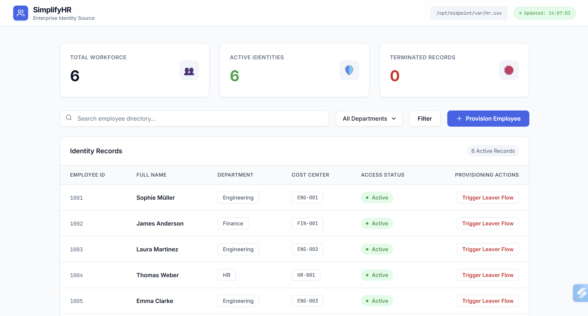
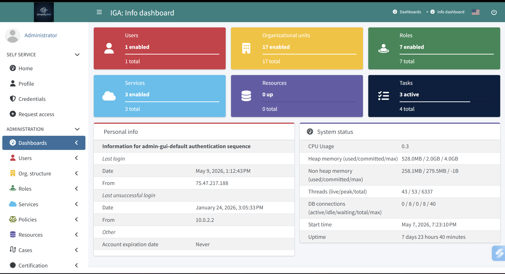
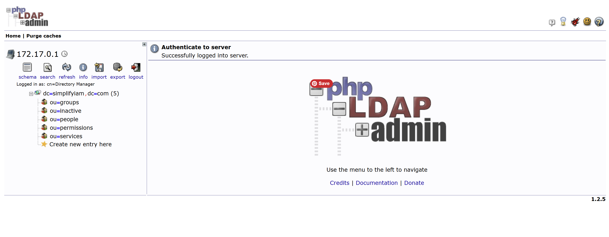 

---

## What I Learned

#### The Four IAM Layers

A key architectural distinction from this session — enterprise IAM is not one system. It is four distinct capability layers:

| Layer | What It Owns | Enterprise Tools | AWS Equivalent | Microsoft Equivalent |
| --- | --- | --- | --- | --- |
| **IGA** | Identity lifecycle, access governance, audit evidence, SoD | SailPoint, Saviynt, midPoint | IAM + Access Analyzer (governance) | Entra ID Governance (Lifecycle Workflows, Entitlement Management, Access Reviews) |
| **Access Management** | Authentication, SSO, MFA, session tokens | Okta, Entra ID, Ping | Cognito, IAM Identity Center | Entra ID (Conditional Access, SSO, MFA) |
| **PAM** | Privileged credential vaulting, just-in-time access, session recording | CyberArk, BeyondTrust | Secrets Manager, SSM Session Manager | Entra PIM (Privileged Identity Management) |
| **CIAM** | External/customer identity, registration, consent, B2C federation | Auth0, Ping, ForgeRock | Cognito User Pools | Azure AD B2C / Entra External ID |

> **NOTE: IGA and Access Management are not the same thing.** IGA answers: *who should have access, and can we prove it?* Access Management answers: *are you who you say you are, and can you get in right now?* Both layers are required. midPoint handles IGA. Auth0 (Week 4) handles Access Management. Conflating them is one of the most common scoping mistakes in enterprise IAM engagements.


#### Stakeholder Mapping

A critical consulting skill introduced in this session: different stakeholders require different communication styles. The same IAM requirement described in technical terms to HR will produce confusion; described in business terms to a security engineer will produce the wrong implementation.

| Stakeholder | What They Care About | How to Speak to Them |
| --- | --- | --- |
| HR | Employee data accuracy, onboarding speed, offboarding compliance | "When HR adds someone, their accounts appear automatically. When they leave, access is revoked the same day." |
| InfoSec | Least privilege, audit trails, SoD enforcement, breach blast radius | "Every access grant and revocation is logged. We can produce evidence for any audit finding." |
| App Owners | Their application isn't broken, access is correct, no support tickets | "We provision to your app via a connector. You define the roles. We enforce them." |
| Auditors | Control evidence, exception documentation, certification records | "Every access event maps to a control. Certifications are scheduled and timestamped." |
| Business / Programme Lead | Cost, timeline, risk reduction | "This eliminates the manual account creation process and the audit risk of stale access." |

**Key principle:** Requirements drive every architecture decision. Arrive at stakeholder workshops with structured discovery questions prepared. Map pain points to business objectives before touching a configuration screen.

#### What I Built

Deployed and verified a three-component enterprise IAM lab environment on a dedicated cloud server. Mapped the architecture across IGA, access management, PAM, and CIAM domains — establishing the conceptual framework that all subsequent provisioning work builds on.


#### Resume Bullet

> Deployed and verified a three-component enterprise IAM lab environment (midPoint IGA, HR source simulator, 389 Directory Server) on a cloud server; mapped architecture across IGA, access management, PAM, and CIAM domains as foundation for full JML lifecycle implementation.

---

## My Transformation

**Where I am starting - Week 1 :** Cloud security engineer with AWS certifications (Solutions Architect, Security Specialty) and hands-on experience building security automation infrastructure — a 16-control GRC compliance platform, an IAM cross-account detection pipeline, and a Zero Trust serverless architecture. Foundation in AWS-native IAM and detection engineering, but no hands-on experience with enterprise IGA platforms or the JML lifecycle that sits upstream of the controls I was already automating.

**Where I am now:** Ongoing ...

**Roles I am targeting but not limited to :**  IAM Solutions Engineer, IAM Engineer, Cloud Security Engineer, GRC Engineer at enterprise security vendors, AWS, or major AWS partners. 

---


### Saturday 2 — Joiner and Leaver Processes

**Session:** May 16, 2026 (completed May 22, 2026)  
**Scenario:** Building the full identity provisioning pipeline from scratch — HR source through IGA to directory target.

---

#### What I Built

Connected a three-component enterprise IAM pipeline end to end. Configured a CSV connector from SimplifyHR into midPoint, seven inbound attribute mappings including Groovy expressions for email generation and lifecycle state translation, correlation rules, and synchronization reactions. Connected 389 Directory Server as a target resource with seven outbound mappings including DN routing and CN generation scripts. Discovered and implemented the role-based construction mechanism that links identity governance to account provisioning. Demonstrated automated Joiner and Leaver workflows with full audit trail evidence.

---

#### Architecture — What the Pipeline Looks Like

```
SimplifyHR (hr.csv)
      |
      | CSV Connector — reads empid, firstname, lastname,
      |                 department, status, costcenter
      v
midPoint — Phase 1
  - 7 inbound mappings (including Groovy for email + lifecycle state)
  - Correlation rule: name = empid (exact match)
  - Focus objects created for all 6 employees
      |
      | Employee role inducement → OpenLDAP construction
      | (THE MISSING LINK — without this, no accounts are provisioned)
      v
midPoint — Phase 2
  - 7 outbound mappings (including DN script + CN script)
  - DN script routes: active → ou=people | disabled → ou=inactive
      |
      | LDAP Connector
      v
389 Directory Server
  - ou=people — active employee accounts
  - ou=inactive — disabled/terminated accounts
```

#### The Most Important Concept From This Session

**The role is the provisioning trigger — not the resource.**

After creating the OpenLDAP resource, running reconciliation produced no LDAP accounts. The resource existed. The identities existed. But nothing was provisioned.

The missing link: the Employee role needed a construction inducement pointing to OpenLDAP. That inducement is the instruction that tells midPoint — for every user with this role, create an account on this resource.

The provisioning chain is: focus object → role assignment → role inducement → resource construction → account on target. Breaking any link in that chain means no provisioning. Understanding this chain is what separates someone who follows a lab guide from someone who can diagnose a provisioning failure at 2am in production.

**Enterprise equivalent:**
- SailPoint IdentityNow: Access Profile with provisioning policy
- Saviynt: Entitlement with provisioning rule
- Concept is identical across all enterprise IGA platforms

---

### Attribute Mapping Reference

**Inbound (SimplifyHR → midPoint focus object):**

| CSV Column | Expression | midPoint Attribute |
|---|---|---|
| empid | As is | name (becomes uid in LDAP) |
| empid | `input + '@simplifytech.com'` | emailAddress |
| firstname | As is | givenName |
| lastname | As is | familyName |
| department | As is | organizationalUnit |
| costcenter | As is | costCenter |
| status | Groovy → ActivationStatusType | activation/administrativeStatus |

**Outbound (midPoint focus object → 389 DS):**

| midPoint Attribute | Expression | LDAP Attribute |
|---|---|---|
| givenName | As is | givenName |
| familyName | As is | sn |
| givenName + familyName | `givenName + ' ' + familyName` | cn |
| name | DN routing script | dn |
| emailAddress | As is | mail |
| costCenter | As is | departmentNumber |
| employeeNumber | As is | employeeNumber |

---

---

#### Screenshots

**Phase 1 — Seven Focus Objects in midPoint**

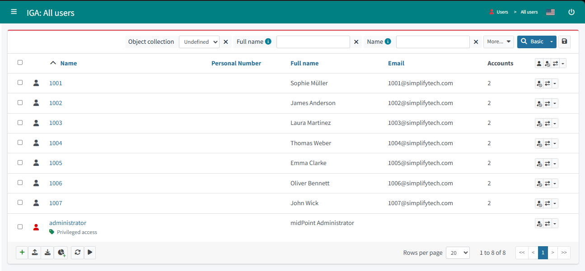

**Phase 2 — Seven Accounts in phpLDAPadmin**


**Joiner — Franken Stein (empid 1008) provisioned automatically**

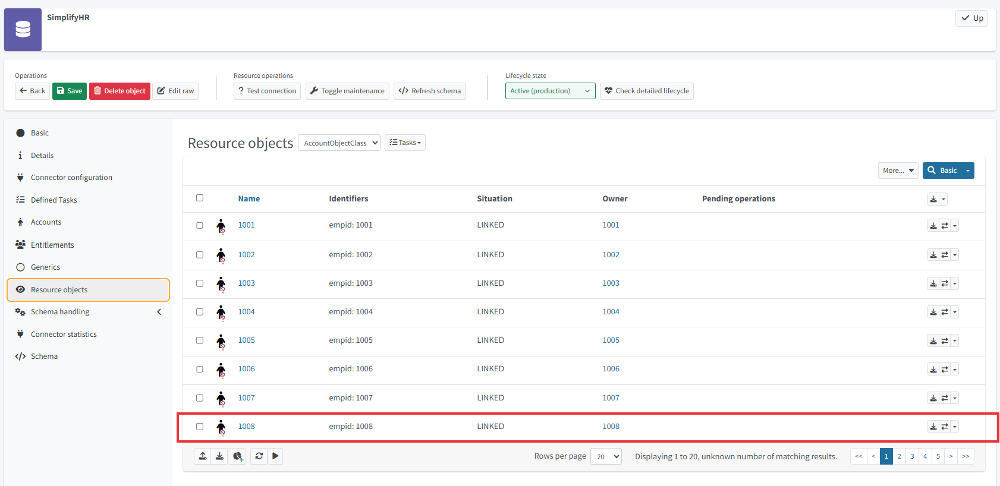
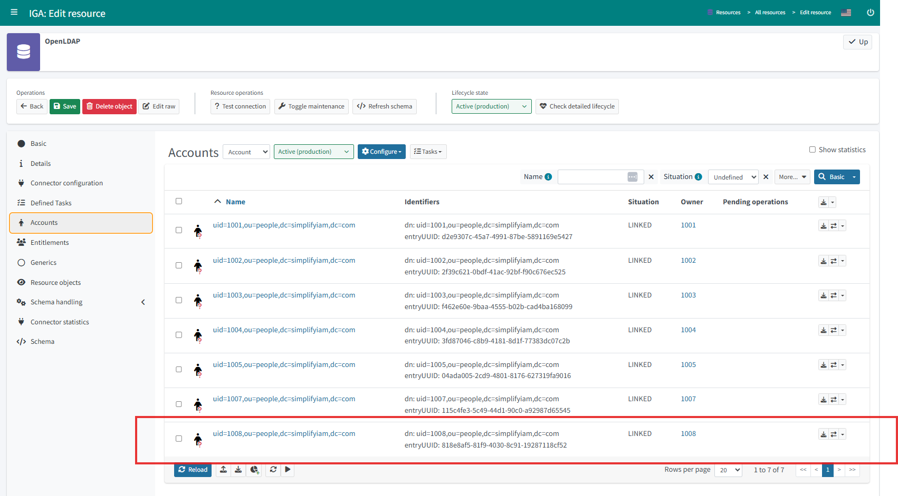

**Leaver — Oliver Bennett (1006) disabled and removed from ou=people**


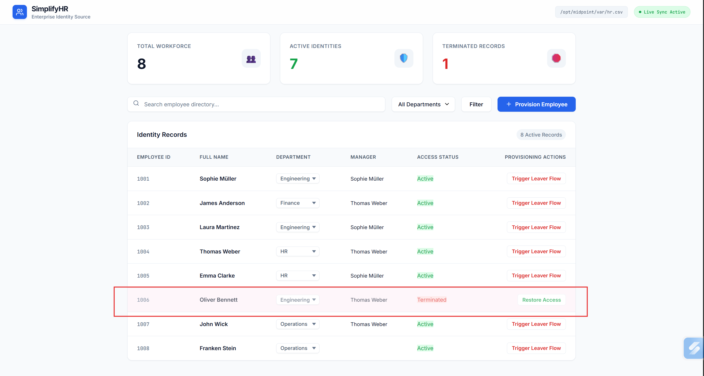

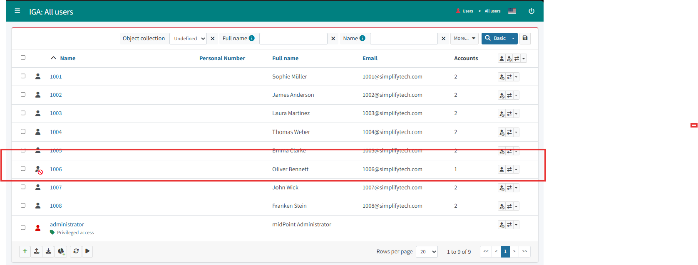


**Audit Log — Add Object (Joiner evidence)**

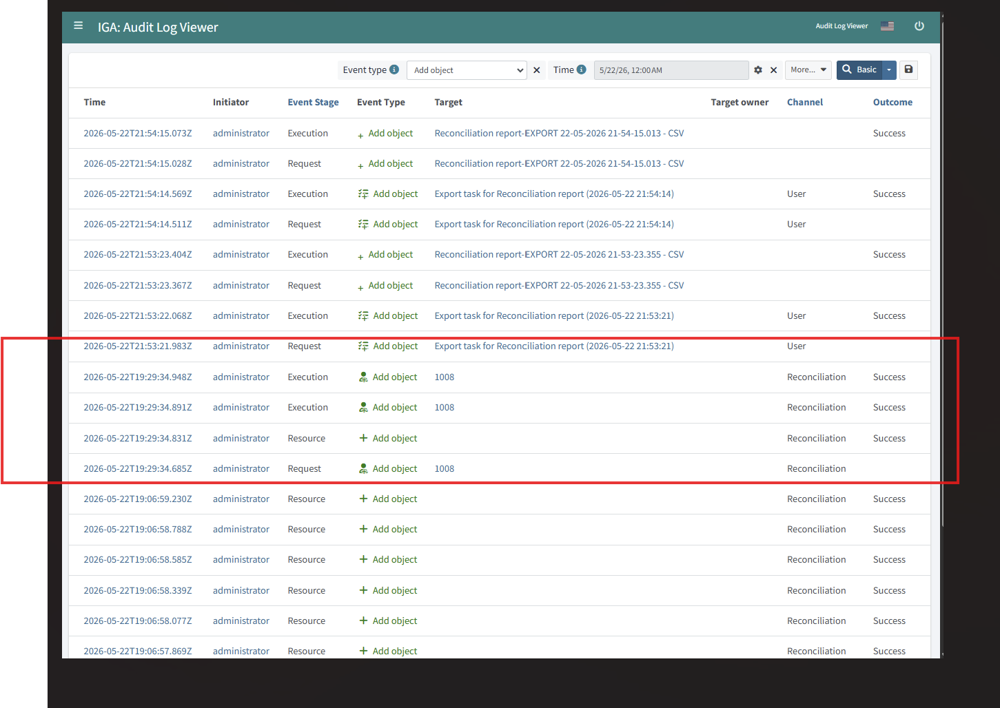

**Audit Log — Leaver evidence**

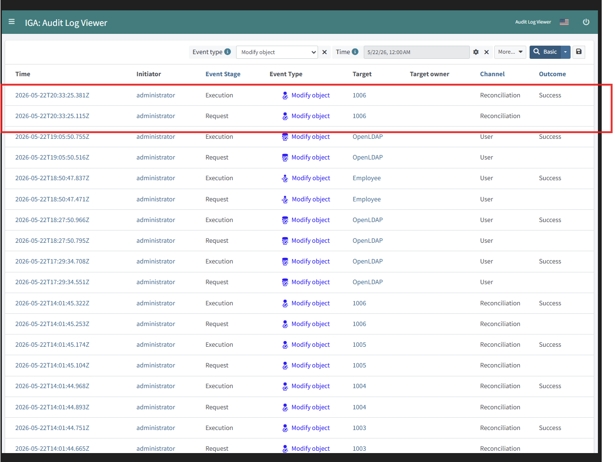

---

#### Audit Log — What the Evidence Shows

Three audit screenshots capture the complete session:

| Event | Timestamp | What It Proves |
|---|---|---|
| Employee role modified | `2026-05-22T18:50:47Z` | OpenLDAP construction inducement added — the provisioning trigger configured |
| Add object × 4 for target 1008 | `2026-05-22T19:29:34Z` | Franken Stein's full Joiner chain — focus object, role assignment, LDAP account — in under one second via Reconciliation |
| Modify object on 1006 | `2026-05-22T20:33:25Z` | Oliver Bennett lifecycle state changed to disabled via Reconciliation |
| Delete object — `uid=1006,ou=people` | `2026-05-22T20:33:25Z` | LDAP account removed via Reconciliation — zero manual steps |

**The channel on every provisioning event is Reconciliation — not User, not GUI, not API.** This is the control evidence. Access was not granted or revoked by a human administrator. It was governed by the IGA pipeline.

---

#### Enterprise Equivalents

| Lab Component | Enterprise Equivalent |
|---|---|
| CSV connector | HR connector (Workday REST, SAP SuccessFactors, BambooHR) |
| Correlation rule on `name` | Authoritative source correlation config in SailPoint IdentityNow |
| Employee role construction | Access Profile with provisioning policy (SailPoint) / Entitlement provisioning rule (Saviynt) |
| `nsAccountLock` | `userAccountControl` flag (Active Directory) / `IsActive: false` (Salesforce) |
| DN routing script | OU movement on disable in AD / deactivation in Okta |
| Reconciliation task | Aggregation task (SailPoint) / scheduled sync job (Saviynt) |
| Audit log — Channel: Reconciliation | System-initiated provisioning evidence for SOC 2 CC6.2 / CC6.3 |

---

#### Production Note — Deletion vs. Disable

In this lab, Oliver Bennett's LDAP account was **deleted** from `ou=people` on termination.

The production-correct pattern is **disable and move to `ou=inactive`** — the DN routing script is already configured to do this. The account record is preserved for compliance investigation. Audit trail, attribute history, and group membership evidence remain intact.

Deleting an account on termination destroys evidence. If a security incident later involves actions taken by that account, the forensic record is gone. In regulated environments (SOX, HIPAA, PCI DSS), this is a compliance gap.

**The distinction to be able to explain in an interview:**
- Lab did: delete account from `ou=people`
- Production should do: disable account (`nsAccountLock: true`) + DN script moves it to `ou=inactive`
- Why: evidence preservation, audit trail continuity, compliance with data retention requirements

---

#### What I Built

> Implemented a complete Joiner and Leaver pipeline in midPoint IGA — configured CSV connector, seven inbound and outbound attribute mappings including Groovy expressions, correlation rules, synchronization reactions, and role-based LDAP construction; demonstrated automated account provisioning and termination across HR source and 389 Directory Server target with full audit trail evidence.

---

#### Resume Bullet

> Implemented end-to-end Joiner and Leaver workflows in midPoint IGA — configured CSV HR source connector, attribute mappings with Groovy expressions, correlation rules, and role-based LDAP construction inducement; demonstrated automated provisioning to 389 Directory Server and termination lifecycle with reconciliation-initiated audit trail evidencing zero manual access changes.


### Saturday 3 — Mover Process and RBAC

**Session:** May 23, 2026  
**Scenario:** Extending SimplifyTech's IGA platform with role-based access control, automated Mover detection, and post-Mover access governance.

---

#### What I Built

Implemented a complete RBAC model with two distinct assignment patterns and executed a full Mover lifecycle end to end. Configured auto-assigned department roles via Object Template condition mappings and a manually requestable Contractor role with request-and-approval workflow. Executed a Mover event by changing Emma Clarke's department from Engineering to HR in SimplifyHR and verified automatic role delta via reconciliation. Set up and ran a full Access Certification campaign as Sophie Müller — actioning three review items and revoking the Contractor role with automated remediation completing the governance loop.

---

#### Architecture — The RBAC and Mover Pipeline

```
SimplifyHR (hr.csv)
      |
      | Department attribute change detected by reconciliation
      v
midPoint — Object Template fires
  - auto-engineering-role condition: organizationalUnit == 'Engineering'
  - auto-hr-role condition: organizationalUnit == 'HR'
  - Contractor: no condition mapping — not auto-assigned or auto-removed
      |
      | Role delta calculated:
      | Engineering_Employee removed (condition false)
      | HR_Employee assigned (condition true)
      | Contractor stays (manually assigned — requires explicit revocation)
      v
Access Certification Campaign
  - Reviewer resolved: extension/managerEmpId = 1001 → Sophie Müller
  - Sophie reviews: Employee (certify), HR_Employee (certify), Contractor (revoke)
  - Automated remediation removes Contractor role after Revoke decision
      |
      v
Audit Trail — complete governance evidence
```

---

#### The Two RBAC Patterns

Every real IAM implementation has both. Understanding the difference is what separates someone who configures tools from someone who designs governance programs.

| Pattern | Roles | Assignment Trigger | Removal Trigger |
|---|---|---|---|
| **Auto-assigned** | Engineering_Employee, HR_Employee | Object Template condition evaluates true | Condition evaluates false on next reconciliation |
| **Manually requested** | Contractor | Explicit self-service request + administrator approval | Explicit revocation or Access Certification campaign decision |

Auto-assigned roles enforce the HR source as the authority. Manually requested roles enforce human accountability for elevated or sensitive access. Both are necessary. Neither is sufficient alone.

---

#### The Most Important Concept From This Session

**The Object Template is the automation engine. `strength: strong` means the HR source always wins.**

The condition mappings fire on every user focus object during every reconciliation run. When Emma Clarke's `organizationalUnit` changed from Engineering to HR, both conditions re-evaluated simultaneously:

```xml
<mapping>
    <name>auto-engineering-role</name>
    <strength>strong</strength>
    <condition>
        <script><code>organizationalUnit == 'Engineering'</code></script>
    </condition>
    <target><path>assignment</path></target>
</mapping>
```

`strength: strong` means if an administrator manually removes Engineering_Employee from a user still in Engineering, the next reconciliation will re-assign it. The Object Template enforces the HR source as authority — not individual administrators.

**Enterprise equivalent:**
- SailPoint IdentityNow: Lifecycle Event rules / birthright role assignment
- Saviynt: Role Assignment Policy
- Microsoft Entra ID Governance: Lifecycle Workflows with role assignment actions

---

#### Screenshots

**Roles list — Engineering_Employee and HR_Employee created**

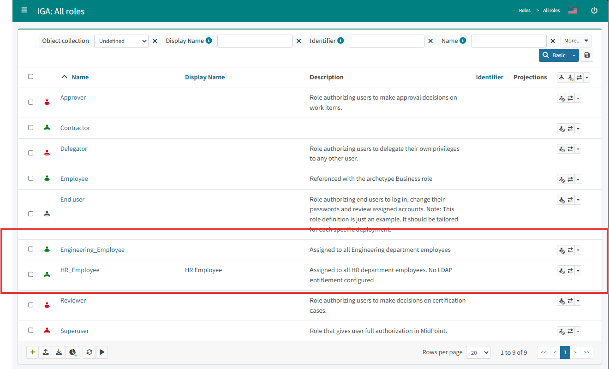

**Engineering_Employee — OpenLDAP Account construction inducement**

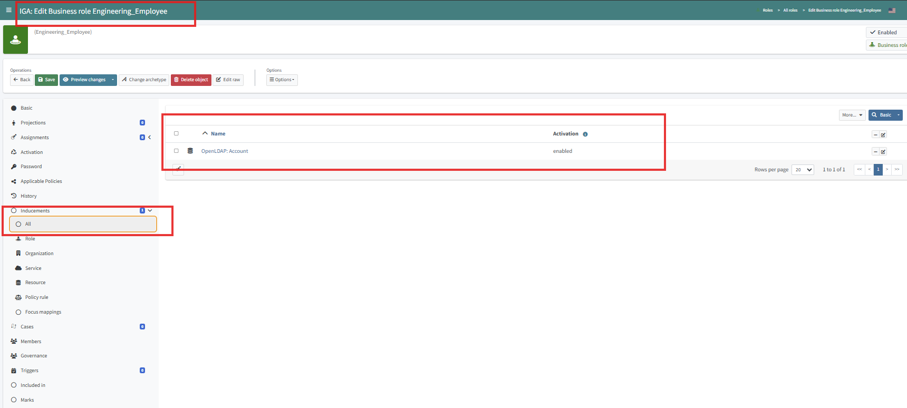

**Emma Clarke — before Mover (Employee, Engineering_Employee, Contractor)**

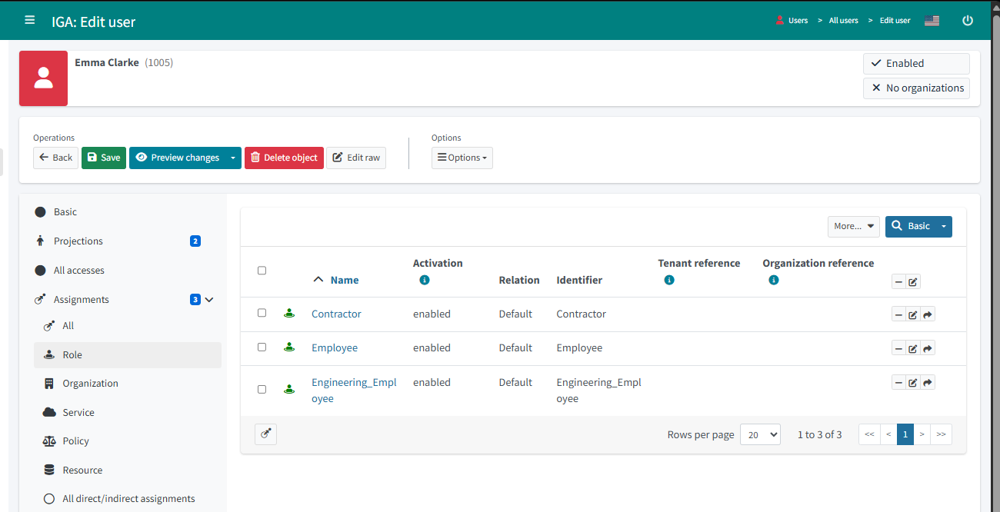

**SimplifyHR — Emma Clarke department changed to HR**

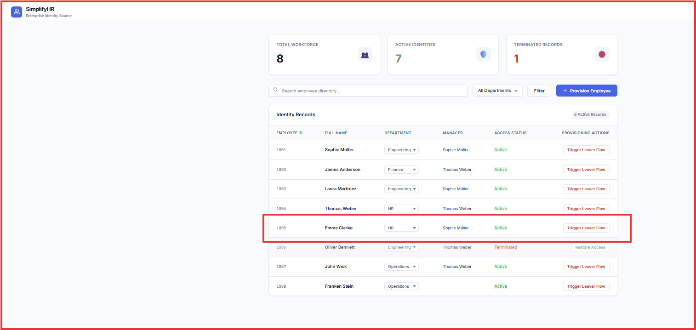

**Emma Clarke — after Mover (Engineering_Employee removed, HR_Employee assigned, Contractor stays)**

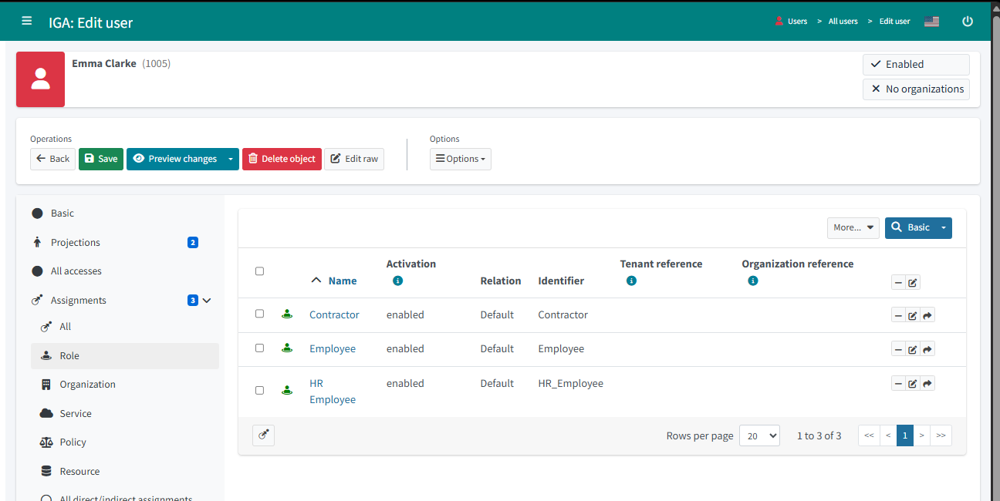

**Sophie Müller — before and after End User role assigned**

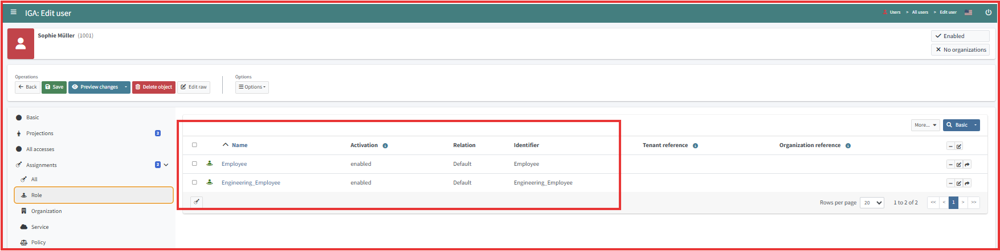
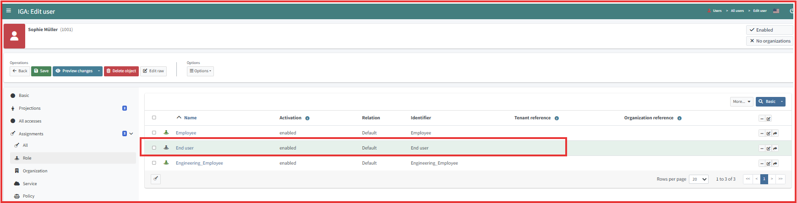

**Object Template — audit log evidence of End User and Reviewer mappings added**

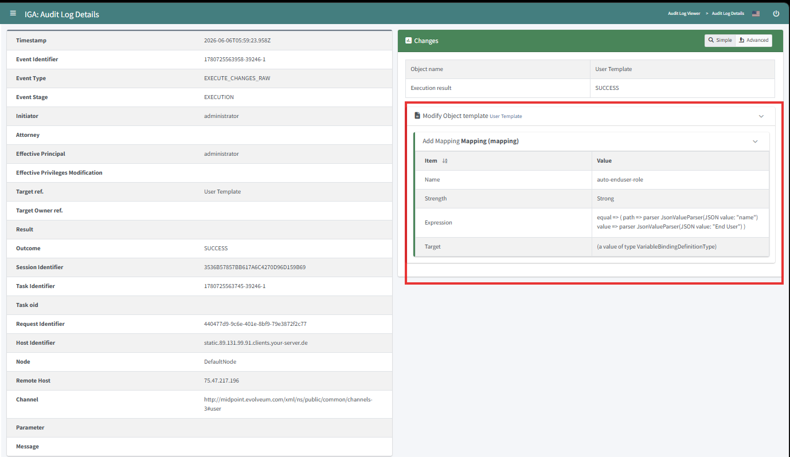
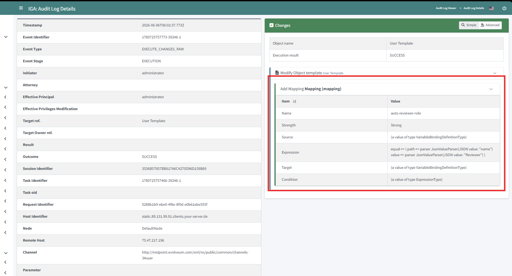

**Access Certification campaign — items under review as Sophie Müller**

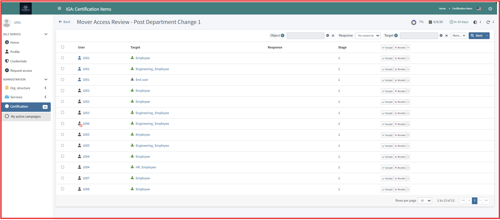

---

#### Audit Log — What the Evidence Shows

| Event | What It Proves |
|---|---|
| Object Template modified — auto-engineering-role added | Condition mapping configured to auto-assign Engineering role |
| Object Template modified — auto-hr-role added | Condition mapping configured to auto-assign HR role |
| Object Template modified — auto-enduser-role added | End User role added to Object Template for all users |
| Object Template modified — auto-reviewer-role added | Reviewer role mapping added to Object Template |
| Emma Clarke (1005) — Modify object via Reconciliation | organizationalUnit changed, Engineering_Employee removed, HR_Employee assigned |
| Access Certification campaign — Contractor revoked | Reviewer decision executed, automated remediation removed Contractor role |

**Lesson learned — screenshot timing:**
The Contractor role was revoked in the certification campaign before the screenshot was taken. In real audit situations, evidence must be captured before actioning items — the screenshot is the visual evidence, and the midPoint audit log is the system-of-record backup. Always screenshot the pending decision first, then action it.

---

#### Enterprise Equivalents

| Lab Component | Enterprise Equivalent |
|---|---|
| Object Template condition mapping | SailPoint Lifecycle Event rule / Saviynt Role Assignment Policy |
| Auto-assigned role | Birthright role / department-driven entitlement |
| Manually requested role | Access request via IGA self-service catalog with approval |
| Request-and-approval workflow | Manager or owner approval workflow in SailPoint / ServiceNow integration |
| Access Certification campaign | Certification campaign (SailPoint) / Access Review (Saviynt / Entra ID Governance) |
| Reviewer resolution via manager attribute | Manager-driven review assignment in SailPoint / Entra ID Access Reviews |
| Automated remediation | Post-certification revocation action in SailPoint IdentityNow |

---

#### GRC and Compliance Evidence

| Event | Control Evidenced | Framework |
|---|---|---|
| Engineering_Employee removed on department change | Access removed when role changes | SOC 2 CC6.3 |
| HR_Employee assigned on department change | Access provisioned appropriate to current role | SOC 2 CC6.2 |
| Contractor request logged with approver identity | Elevated access granted through authorized workflow | SOC 2 CC6.1 / CC6.2 |
| Certification campaign with reviewer decisions | Periodic access review with documented decisions | SOC 2 CC6.6 |
| Contractor revoked + automated remediation | Access removed following review decision | SOC 2 CC6.3 |
| All role changes via Reconciliation | System-governed access changes, not manual | SOC 2 CC6.1 |

---

#### Production Note — Why the Mover Is Riskier Than the Joiner

A Joiner starts from nothing. The worst outcome is too much access from day one, visible and auditable from the first provisioning event.

A Mover carries their history. Every manually assigned role, every access granted before the IGA platform existed, every system not connected to the IGA platform, all of it persists through the Mover event unless explicitly revoked. The Contractor role staying after Emma's department change is a controlled example of exactly this pattern.

In a real enterprise Mover event, the same applies to Salesforce profiles, GitHub repository membership, AWS permission sets, and application-specific permissions accumulated over years. Access Certification is not optional, it is the only mechanism that catches what automated provisioning cannot reach.

---

#### What I Built

Implemented role-based access control in midPoint IGA with auto-assigned department roles via Object Template conditions and a manually requestable Contractor role with approval workflow. Executed a Mover event demonstrating automated role delta and ran a full Access Certification campaign with reviewer resolution, certification decisions, and automated remediation completing the governance loop end to end.

---

#### Resume Bullet

> Implemented RBAC in midPoint IGA — configured auto-assigned department roles via Object Template conditions and manually requestable Contractor role with approval workflow; executed Mover event with automated role delta and ran full Access Certification campaign with manager-resolved reviewer, certification decisions, and automated remediation.
