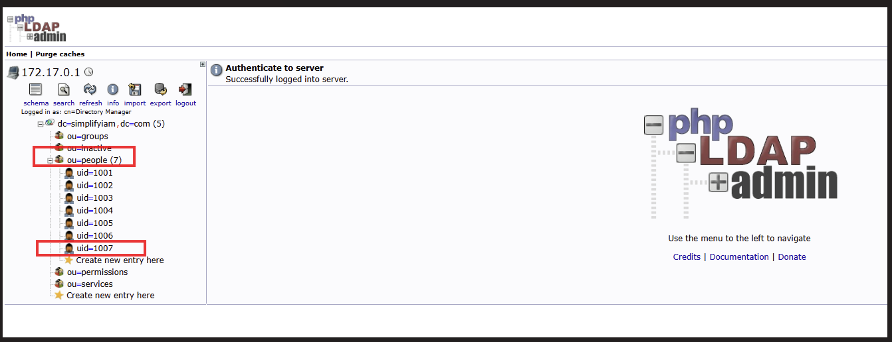
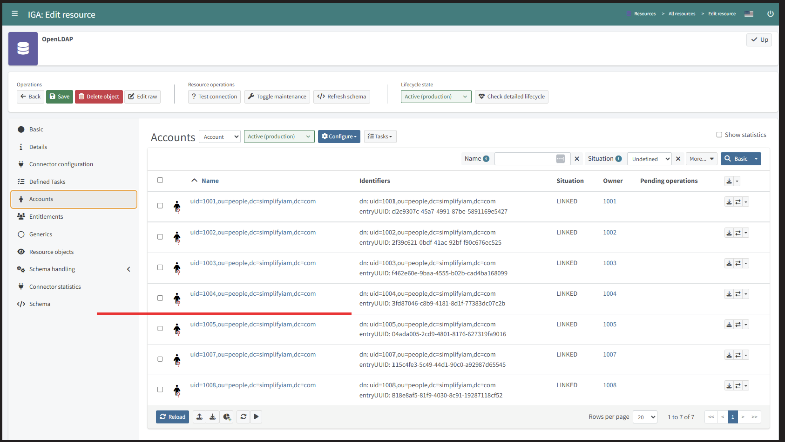

### Saturday 2 — Joiner and Leaver Processes

**Session:** May 16, 2026 (completed May 22, 2026)  
**Scenario:** Building the full identity provisioning pipeline from scratch — HR source through IGA to directory target.

---

#### What I Built

Connected a three-component enterprise IAM pipeline end to end. Configured a CSV connector from SimplifyHR into midPoint, seven inbound attribute mappings including Groovy expressions for email generation and lifecycle state translation, correlation rules, and synchronization reactions. Connected 389 Directory Server as a target resource with seven outbound mappings including DN routing and CN generation scripts. Discovered and implemented the role-based construction mechanism that links identity governance to account provisioning. Demonstrated automated Joiner and Leaver workflows with full audit trail evidence.

---

#### Architecture — What the Pipeline Looks Like

```
SimplifyHR (hr.csv)
      |
      | CSV Connector — reads empid, firstname, lastname,
      |                 department, status, costcenter
      v
midPoint — Phase 1
  - 7 inbound mappings (including Groovy for email + lifecycle state)
  - Correlation rule: name = empid (exact match)
  - Focus objects created for all 6 employees
      |
      | Employee role inducement → OpenLDAP construction
      | (THE MISSING LINK — without this, no accounts are provisioned)
      v
midPoint — Phase 2
  - 7 outbound mappings (including DN script + CN script)
  - DN script routes: active → ou=people | disabled → ou=inactive
      |
      | LDAP Connector
      v
389 Directory Server
  - ou=people — active employee accounts
  - ou=inactive — disabled/terminated accounts
```

---

#### The Most Important Concept From This Session

**The role is the provisioning trigger — not the resource.**

After creating the OpenLDAP resource, running reconciliation produced no LDAP accounts. The resource existed. The identities existed. But nothing was provisioned.

The missing link: the Employee role needed a construction inducement pointing to OpenLDAP. That inducement is the instruction that tells midPoint — for every user with this role, create an account on this resource.

The provisioning chain is: focus object → role assignment → role inducement → resource construction → account on target. Breaking any link in that chain means no provisioning. Understanding this chain is what separates someone who follows a lab guide from someone who can diagnose a provisioning failure at 2am in production.

**Enterprise equivalent:**
- SailPoint IdentityNow: Access Profile with provisioning policy
- Saviynt: Entitlement with provisioning rule
- Concept is identical across all enterprise IGA platforms

---

#### Attribute Mapping Reference

**Inbound (SimplifyHR → midPoint focus object):**

| CSV Column | Expression | midPoint Attribute |
|---|---|---|
| empid | As is | name (becomes uid in LDAP) |
| empid | `input + '@simplifytech.com'` | emailAddress |
| firstname | As is | givenName |
| lastname | As is | familyName |
| department | As is | organizationalUnit |
| costcenter | As is | costCenter |
| status | Groovy → ActivationStatusType | activation/administrativeStatus |

**Outbound (midPoint focus object → 389 DS):**

| midPoint Attribute | Expression | LDAP Attribute |
|---|---|---|
| givenName | As is | givenName |
| familyName | As is | sn |
| givenName + familyName | `givenName + ' ' + familyName` | cn |
| name | DN routing script | dn |
| emailAddress | As is | mail |
| costCenter | As is | departmentNumber |
| employeeNumber | As is | employeeNumber |

---

#### Screenshots

**Phase 1 — Six Focus Objects in midPoint**


**Phase 2 — Six Accounts in phpLDAPadmin**



**Joiner — Franken Stein (empid 1008) provisioned automatically**


**Leaver — Oliver Bennett (1006) disabled and removed from ou=people**




**Audit Log — Add Object (Joiner evidence)**


**Audit Log — Leaver evidence**


---

#### Audit Log — What the Evidence Shows

Three audit screenshots capture the complete session:

| Event | Timestamp | What It Proves |
|---|---|---|
| Employee role modified | `2026-05-22T18:50:47Z` | OpenLDAP construction inducement added — the provisioning trigger configured |
| Add object × 4 for target 1008 | `2026-05-22T19:29:34Z` | Franken Stein's full Joiner chain — focus object, role assignment, LDAP account — in under one second via Reconciliation |
| Modify object on 1006 | `2026-05-22T20:33:25Z` | Oliver Bennett lifecycle state changed to disabled via Reconciliation |
| Delete object — `uid=1006,ou=people` | `2026-05-22T20:33:25Z` | LDAP account removed via Reconciliation — zero manual steps |

**The channel on every provisioning event is Reconciliation — not User, not GUI, not API.** This is the control evidence. Access was not granted or revoked by a human administrator. It was governed by the IGA pipeline.

---

#### Enterprise Equivalents

| Lab Component | Enterprise Equivalent |
|---|---|
| CSV connector | HR connector (Workday REST, SAP SuccessFactors, BambooHR) |
| Correlation rule on `name` | Authoritative source correlation config in SailPoint IdentityNow |
| Employee role construction | Access Profile with provisioning policy (SailPoint) / Entitlement provisioning rule (Saviynt) |
| `nsAccountLock` | `userAccountControl` flag (Active Directory) / `IsActive: false` (Salesforce) |
| DN routing script | OU movement on disable in AD / deactivation in Okta |
| Reconciliation task | Aggregation task (SailPoint) / scheduled sync job (Saviynt) |
| Audit log — Channel: Reconciliation | System-initiated provisioning evidence for SOC 2 CC6.2 / CC6.3 |

---

#### Production Note — Deletion vs. Disable

In this lab, Oliver Bennett's LDAP account was **deleted** from `ou=people` on termination.

The production-correct pattern is **disable and move to `ou=inactive`** — the DN routing script is already configured to do this. The account record is preserved for compliance investigation. Audit trail, attribute history, and group membership evidence remain intact.

Deleting an account on termination destroys evidence. If a security incident later involves actions taken by that account, the forensic record is gone. In regulated environments (SOX, HIPAA, PCI DSS), this is a compliance gap.

**The distinction to be able to explain in an interview:**
- Lab did: delete account from `ou=people`
- Production should do: disable account (`nsAccountLock: true`) + DN script moves it to `ou=inactive`
- Why: evidence preservation, audit trail continuity, compliance with data retention requirements

---

#### What I Built

> Implemented a complete Joiner and Leaver pipeline in midPoint IGA — configured CSV connector, seven inbound and outbound attribute mappings including Groovy expressions, correlation rules, synchronization reactions, and role-based LDAP construction; demonstrated automated account provisioning and termination across HR source and 389 Directory Server target with full audit trail evidence.

---

#### Resume Bullet

> Implemented end-to-end Joiner and Leaver workflows in midPoint IGA — configured CSV HR source connector, attribute mappings with Groovy expressions, correlation rules, and role-based LDAP construction inducement; demonstrated automated provisioning to 389 Directory Server and termination lifecycle with reconciliation-initiated audit trail evidencing zero manual access changes.
